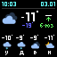

# pixoo64-for-home
Divoom pixoo64 display for home usage

**screenshots**



**run**
```
docker run -d \
  --name pixoo64 \
  -e ENV="prod" \
  -e PIXOO_ADDRESS="192.168.0.100" \
  -e YANDEX_WEATHER_KEY="key" \
  -e YANDEX_WEATHER_LAT="55.751" \
  -e YANDEX_WEATHER_LON="37.618" \
  ghcr.io/andreiberezin/pixoo64-for-home:latest
```

**divoom docs**
http://doc.divoom-gz.com/web/#/12?page_id=195