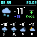
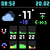
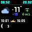
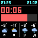
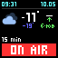

<div align="center">

**Русский** | [English](README_EN.md)

# pixoo64-for-home

Показывает погоду, геомагнетизм, фазы луны и таймер на дисплее Divoom Pixoo64. Информация обновляется каждую минуту. Написано на Go, запускается через Docker.

[](https://go.dev/)
[](https://ghcr.io/andreiberezin/pixoo64-for-home)
[](https://www.divoom.com/products/pixoo-64)

</div>

---

## ✨ Что умеет

<table>
<tr>
<td width="50%" valign="top">🌤️ <b>Текущая погода</b><br/>Температура, ощущаемая, скорость и направление ветра, иконка погоды. Всегда на верхней половине экрана.</td>
<td width="50%" valign="top">📅 <b>Прогноз по периодам дня</b><br/>Утро, день, вечер, ночь — иконка и температура. Показываются только актуальные периоды.</td>
</tr>
<tr>
<td width="50%" valign="top">🧲 <b>Геомагнетизм и давление</b><br/>Почасовые графики за несколько дней. 🟢 норма, 🟡 отклонение, 🔴 плохо.</td>
<td width="50%" valign="top">🌙 <b>Восход, закат и луна</b><br/>Время восхода и заката солнца. Фаза луны с иконкой и номер лунного дня (0–29).</td>
</tr>
<tr>
<td width="50%" valign="top">⏱️ <b>Таймер</b><br/>Обратный отсчёт по cron-расписанию с прогресс-баром. Пищит каждую минуту.</td>
<td width="50%" valign="top">🔴 <b>ON AIR</b><br/>Индикатор «в эфире» на нижней половине экрана во время звонков. Активируется через <b>micwatch</b> при захвате микрофона.</td>
</tr>
</table>

---

## 📸 Скриншоты

<table>
<tr>
<td width="50%" style="padding: 16px">
Прогноз по периодам дня<br/>
</td>
<td width="50%" style="padding: 16px">
Геомагнетизм и давление<br/>
</td>
</tr>
<tr>
<td width="50%" style="padding: 16px">
Восход, закат и луна<br/>
</td>
<td width="50%" style="padding: 16px">
Таймер<br/>
</td>
</tr>
<tr>
<td width="50%" style="padding: 16px">
ON AIR<br/>
</td>
</tr>
</table>

---

## 🚀 Быстрый старт

```bash
docker run -d \
  --name pixoo64 \
  --restart unless-stopped \
  -p 8080:8080 \
  -e ENV="prod" \
  -e APP_LANG="ru" \
  -e PIXOO_ADDRESS="192.168.0.100" \
  -e YANDEX_WEATHER_KEY="ваш_ключ" \
  -e LAT="55.751" \
  -e LON="37.618" \
  -e TIMERS='[{"at":"40 8 * * 1-5","notify_duration_min":20}]' \
  ghcr.io/andreiberezin/pixoo64-for-home:latest
```

---

## ⚙️ Конфигурация

```bash
cp .env.example .env
```

| Переменная | Описание | Пример |
|---|---|---|
| `ENV` | `prod` или `dev` (debug — сохраняет `dev_img.png`, не отправляет на дисплей) | `prod` |
| `APP_LANG` | Язык подписей на экране: `ru` или `en` | `ru` |
| `PIXOO_ADDRESS` | IP-адрес дисплея в локальной сети | `192.168.0.100` |
| `LAT` | Широта | `55.751` |
| `LON` | Долгота | `37.618` |
| `YANDEX_WEATHER_KEY` | Ключ API Яндекс Погоды | `xxxxxxxx-xxxx-...` |
| `TIMERS` | JSON-массив cron-таймеров | см. ниже |

### 🔑 Где взять ключ Яндекс Погоды

1. Зарегистрируйтесь на [yandex.ru/pogoda/b2b/smarthome](https://yandex.ru/pogoda/b2b/smarthome) — нужен номер телефона
2. После регистрации API-ключ будет доступен в личном кабинете
3. Бесплатный тариф — только для некоммерческого использования, данные на сегодня и завтра

### 📍 Где взять координаты

Откройте [Яндекс Карты](https://yandex.ru/maps) или [Google Maps](https://maps.google.com) → правый клик по нужной точке → скопируйте координаты. Широта (`LAT`) — первое число, долгота (`LON`) — второе.

> Москва: `LAT=55.751`, `LON=37.618`

### ⏰ Таймеры

`TIMERS` — JSON-массив. Каждый объект — один таймер:

| Поле | Тип | Описание |
|---|---|---|
| `at` | string | Cron-выражение: минута, час, день, месяц, день недели |
| `notify_duration_min` | int | Длительность отсчёта в минутах |

```json
[
  {"at": "40 8 * * 1-5", "notify_duration_min": 20},
  {"at": "0 13 * * 1-5", "notify_duration_min": 30}
]
```

---

## 🎙️ micwatch — индикатор микрофона (macOS)

`micwatch` — фоновый агент для macOS, который следит за состоянием микрофона через CoreAudio и отправляет HTTP-запросы в pixoo64-for-home при включении/выключении. Полезно для отображения индикатора «в эфире» на дисплее во время звонков.

**Требования:** macOS 12.0+

### Установка

```bash
cd micwatch
make install                    # сборка + копирование бинарника в ~/bin
make start HOST=192.168.0.100   # запуск как LaunchAgent
```

`HOST` — IP-адрес машины, где запущен pixoo64-for-home. После `make start` агент запускается сразу и автоматически стартует при каждом входе в систему.

### Ручная сборка

Нужен `swiftc` (входит в Xcode Command Line Tools):

```bash
xcode-select --install  # если не установлено
cd micwatch
make build              # универсальный бинарник build/micwatch (arm64 + x86_64)
```

### Управление

| Команда | Действие |
|---|---|
| `make start HOST=...` | Запустить |
| `make stop` | Остановить |
| `make restart HOST=...` | Перезапустить |
| `make status` | Статус |
| `make uninstall` | Удалить агент и бинарник |

---

## 🛠️ Локальная разработка

```bash
ENV=dev go run main.go
```

В режиме `dev` рендер сохраняется в `dev_img.png`. Погодные данные берутся из мок-файла — Яндекс API не нужен.

---

<div align="center">

[Divoom API docs](http://doc.divoom-gz.com/web/#/12?page_id=195) · [Open-Meteo](https://open-meteo.com/) · [Яндекс Погода для умного дома](https://yandex.ru/pogoda/b2b/smarthome)

</div>
