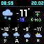
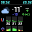
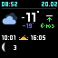
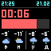

<div align="center">

**English** | [Русский](README.md)

# pixoo64-for-home

Shows weather, geomagnetism, moon phases, and a countdown timer on the Divoom Pixoo64 display. Updates every minute. Written in Go, runs via Docker.

[](https://go.dev/)
[](https://ghcr.io/andreiberezin/pixoo64-for-home)
[](https://www.divoom.com/products/pixoo-64)

</div>

---

## ✨ Features

<table>
<tr>
<td width="50%" valign="top">

🌤️ **Current weather**
Temperature, feels-like, wind speed and direction, weather icon. Always on the top half of the screen.

</td>
<td width="50%" valign="top">

📅 **Daily forecast**
Morning, daytime, evening, night — icon and temperature. Only shows periods relevant to the current time.

</td>
</tr>
<tr>
<td width="50%" valign="top">

🧲 **Geomagnetism & pressure**
Hourly charts for multiple days. Green — normal, yellow — moderate, red — high.

</td>
<td width="50%" valign="top">

🌙 **Sunrise, sunset & moon**
Sunrise and sunset times. Moon phase icon and lunar day number (0–29).

</td>
</tr>
<tr>
<td colspan="2" valign="top">

⏱️ **Timer**
Countdown on a cron schedule with a progress bar. Turns red at < 10 minutes, beeps at start and boundary times.

</td>
</tr>
</table>

---

## 📸 Screenshots

### Daily forecast



### Geomagnetism & pressure



### Sunrise, sunset & moon



### Timer



---

## 🚀 Quick start

```bash
docker run -d \
  --name pixoo64 \
  --restart unless-stopped \
  -e ENV="prod" \
  -e PIXOO_ADDRESS="192.168.0.100" \
  -e YANDEX_WEATHER_KEY="your_key" \
  -e LAT="55.751" \
  -e LON="37.618" \
  -e TIMERS='[{"at":"40 8 * * 1-5","notify_duration_min":20}]' \
  ghcr.io/andreiberezin/pixoo64-for-home:latest
```

---

## ⚙️ Configuration

```bash
cp .env.example .env
```

| Variable | Description | Example |
|---|---|---|
| `ENV` | `prod` or `dev` (debug — saves `dev_img.png`, skips device rendering) | `prod` |
| `PIXOO_ADDRESS` | IP address of the Pixoo64 on your local network | `192.168.0.100` |
| `LAT` | Latitude | `55.751` |
| `LON` | Longitude | `37.618` |
| `YANDEX_WEATHER_KEY` | Yandex Weather API key | `xxxxxxxx-xxxx-...` |
| `TIMERS` | JSON array of cron-based timers | see below |

### 🔑 Getting a Yandex Weather API key

1. Register at [yandex.ru/pogoda/b2b/smarthome](https://yandex.ru/pogoda/b2b/smarthome) — phone number required
2. After registration, the API key will be available in your account dashboard
3. Free tier — non-commercial use only, data for today and tomorrow

### 📍 Getting coordinates

Open [Yandex Maps](https://yandex.ru/maps) or [Google Maps](https://maps.google.com) → right-click your location → copy coordinates. Latitude (`LAT`) is the first number, longitude (`LON`) is the second.

> Moscow: `LAT=55.751`, `LON=37.618`

### ⏰ Timers

`TIMERS` is a JSON array. Each object is one timer:

| Field | Type | Description |
|---|---|---|
| `at` | string | Cron expression: minute, hour, day, month, weekday |
| `notify_duration_min` | int | Countdown duration in minutes |

```json
[
  {"at": "40 8 * * 1-5", "notify_duration_min": 20},
  {"at": "0 13 * * 1-5", "notify_duration_min": 30}
]
```

---

## 🛠️ Local development

```bash
ENV=dev go run main.go
```

In `dev` mode the render is saved to `dev_img.png`. Weather data is loaded from a mock file — no Yandex API key needed.

---

<div align="center">

[Divoom API docs](http://doc.divoom-gz.com/web/#/12?page_id=195) · [Open-Meteo](https://open-meteo.com/) · [Yandex Weather for Smart Home](https://yandex.ru/pogoda/b2b/smarthome)

</div>
